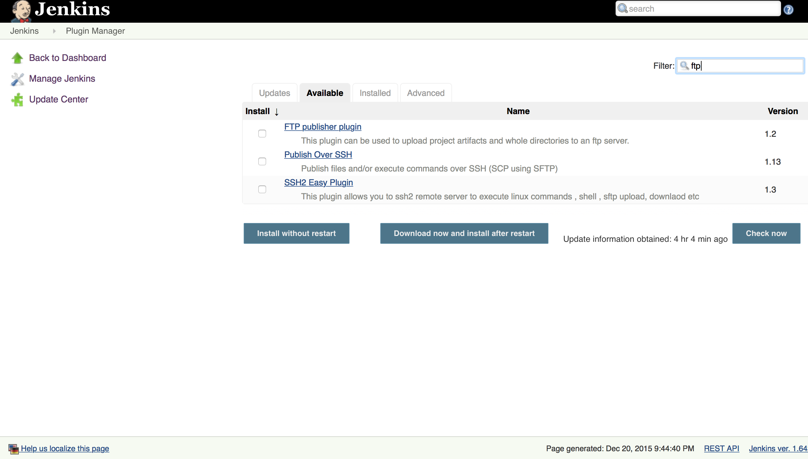
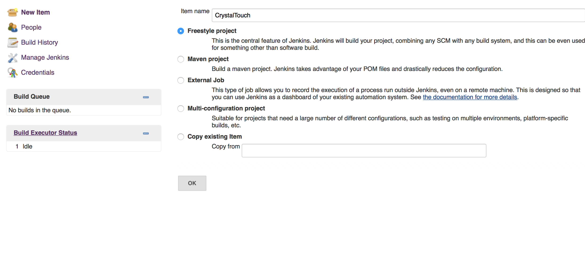
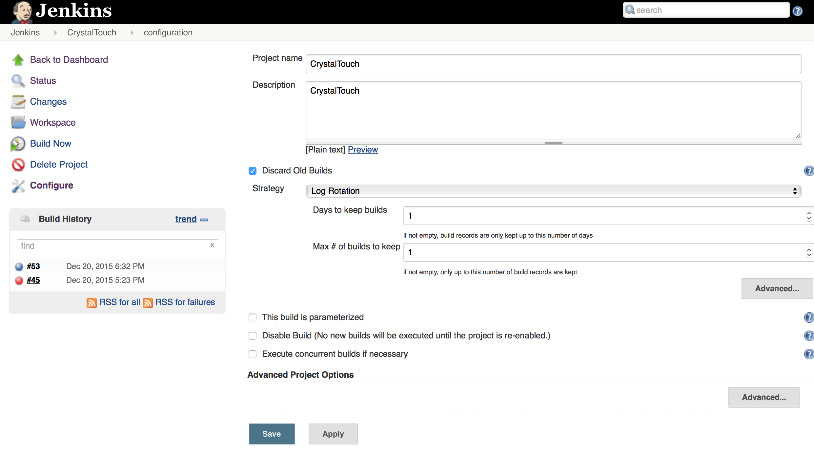
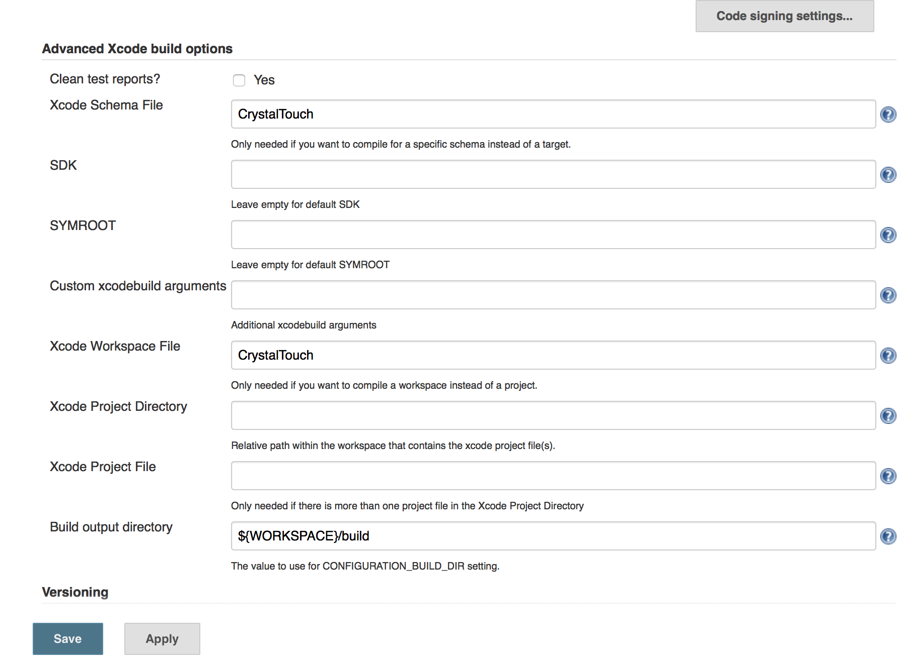
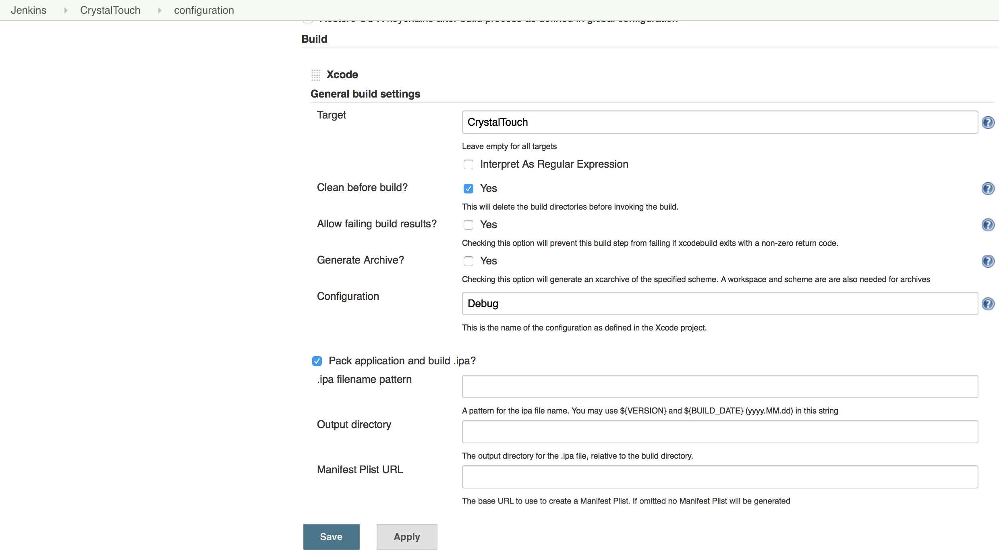

# Jenkins

```
iOS jenkins CI Code Sign error: No matching provisioning profile found

1.Ensure the project is building successfully from Xcode to real target.

-In KeyChain
2. Copy all the development cretificates & credentials form your user folder to the system folder

3.Copy all the Provisioning profiles existing in
~/Library/MobileDevice/Provisioning Profiles
to
Jenkins/Library/MobileDevice/Provisioning Profiles

sudo chown -R admin:staff xxx
```

Step1.

Xcode plugin  
  
FTP plugin  
  
Step2.

Generate Item  


Step3.

Setting  
  
  


Inject environment variables to the build process:  
  DEVELOPER\_DIR=/Applications/Xcode7.3.app/Contents/Developer

Inject passwords to the build as environment variables:  
  ....

# Build with xcodebuilder:


1. ```
   # ADJUST PLIST 
   #!/bin/sh

   DATE=$(date +%Y%m%d)

   INFOPLIST_FILE=${WORKSPACE}/DLR/SHDR/SHDR-Info.plist
   #MAJOR_VERSION=1
   #MINOR_VERSION=5
   #PATCH=0
   #PRELEASE_VERSION="alpha"

   #Grabs info from plist
   plist=$INFOPLIST_FILE
   #appName="DLR Ref"

   #currentVersion=${MAJOR_VERSION}"."${MINOR_VERSION}"."${PATCH}"-"$PRELEASE_VERSION
   #currentVersion=${MAJOR_VERSION}"."${MINOR_VERSION}"-"$PRELEASE_VERSION

   /usr/libexec/PlistBuddy -c "Set :CFBundleVersion ${DATE}" "$plist"
   /usr/libexec/PlistBuddy -c "Set :CFBundleShortVersionString '4.5 SHDR NewRegulation (${BUILD_NUMBER})'" "$plist"
   #/usr/libexec/PlistBuddy -c "Set :CFBundleIdentifier "$(
   ) "$plist"

   ```

1. config.xml

```xml
<?xml version='1.0' encoding='UTF-8'?>
<project>
  <actions/>
  <description>temp</description>
  <keepDependencies>false</keepDependencies>
  <properties>
    <jenkins.model.BuildDiscarderProperty>
      <strategy class="hudson.tasks.LogRotator">
        <daysToKeep>-1</daysToKeep>
        <numToKeep>10</numToKeep>
        <artifactDaysToKeep>-1</artifactDaysToKeep>
        <artifactNumToKeep>-1</artifactNumToKeep>
      </strategy>
    </jenkins.model.BuildDiscarderProperty>
    <hudson.plugins.disk__usage.DiskUsageProperty plugin="disk-usage@0.28"/>
    <com.coravy.hudson.plugins.github.GithubProjectProperty plugin="github@1.19.2">
      <projectUrl>https://githubcom/xxxxMobile/xxxx-xxxx/</projectUrl>
      <displayName></displayName>
    </com.coravy.hudson.plugins.github.GithubProjectProperty>
    <org.jenkinsci.plugins.mavenrepocleaner.MavenRepoCleanerProperty plugin="maven-repo-cleaner@1.2">
      <notOnThisProject>false</notOnThisProject>
    </org.jenkinsci.plugins.mavenrepocleaner.MavenRepoCleanerProperty>
  </properties>
  <scm class="hudson.plugins.git.GitSCM" plugin="git@2.5.2">
    <configVersion>2</configVersion>
    <userRemoteConfigs>
      <hudson.plugins.git.UserRemoteConfig>
        <url>https://github.xxxx.com/xxxxMobile/xxxx-xxxx</url>
        <credentialsId>be937464-2a80-40b4-9856-097d77a0c963</credentialsId>
      </hudson.plugins.git.UserRemoteConfig>
    </userRemoteConfigs>
    <branches>
      <hudson.plugins.git.BranchSpec>
        <name>feature/xxxx</name>
      </hudson.plugins.git.BranchSpec>
    </branches>
    <doGenerateSubmoduleConfigurations>false</doGenerateSubmoduleConfigurations>
    <browser class="hudson.plugins.git.browser.GithubWeb">
      <url>https://github.xxxx.com/xxxxMobile/xxxx-xxxx</url>
    </browser>
    <submoduleCfg class="list"/>
    <extensions>
      <hudson.plugins.git.extensions.impl.CheckoutOption>
        <timeout>480</timeout>
      </hudson.plugins.git.extensions.impl.CheckoutOption>
      <hudson.plugins.git.extensions.impl.CloneOption>
        <shallow>false</shallow>
        <noTags>false</noTags>
        <reference></reference>
        <timeout>480</timeout>
        <depth>0</depth>
      </hudson.plugins.git.extensions.impl.CloneOption>
      <hudson.plugins.git.extensions.impl.SubmoduleOption>
        <disableSubmodules>false</disableSubmodules>
        <recursiveSubmodules>false</recursiveSubmodules>
        <trackingSubmodules>false</trackingSubmodules>
        <reference></reference>
        <timeout>480</timeout>
      </hudson.plugins.git.extensions.impl.SubmoduleOption>
    </extensions>
  </scm>
  <assignedNode>xxxx-mac-mini</assignedNode>
  <canRoam>false</canRoam>
  <disabled>false</disabled>
  <blockBuildWhenDownstreamBuilding>false</blockBuildWhenDownstreamBuilding>
  <blockBuildWhenUpstreamBuilding>false</blockBuildWhenUpstreamBuilding>
  <triggers>
    <hudson.triggers.TimerTrigger>
      <spec>H 22 * * *</spec>
    </hudson.triggers.TimerTrigger>
  </triggers>
  <concurrentBuild>false</concurrentBuild>
  <builders>
    <hudson.tasks.Shell>
      <command>#export LC_ALL="en_US.UTF-8"
#cd xxxx && /usr/local/bin/pod repo update
#--verbose</command>
    </hudson.tasks.Shell>
    <hudson.tasks.Shell>
      <command># ADJUST PLIST 
#!/bin/sh

DATE=$(date +%Y%m%d)

INFOPLIST_FILE=${WORKSPACE}/xxxx/xxxx/xxxx-Info.plist
#MAJOR_VERSION=1
#MINOR_VERSION=5
#PATCH=0
#PRELEASE_VERSION="alpha"

#Grabs info from plist
plist=$INFOPLIST_FILE

#currentVersion=${MAJOR_VERSION}"."${MINOR_VERSION}"."${PATCH}"-"$PRELEASE_VERSION
#currentVersion=${MAJOR_VERSION}"."${MINOR_VERSION}"-"$PRELEASE_VERSION

/usr/libexec/PlistBuddy -c "Set :CFBundleVersion ${DATE}" "$plist"
/usr/libexec/PlistBuddy -c "Set :CFBundleShortVersionString 'xxxx xxxx (${BUILD_NUMBER})'" "$plist"
#/usr/libexec/PlistBuddy -c "Set :CFBundleIdentifier "$(PRODUCT_BUNDLE_IDENTIFIER) "$plist"
</command>
    </hudson.tasks.Shell>
    <hudson.tasks.Shell>
      <command># UNLICK KEYCHAIN
security unlock -p $keychainPassword ~/Library/Keychains/login.keychain</command>
    </hudson.tasks.Shell>
    <hudson.tasks.Shell>
      <command>#xcodebuild \
#  -workspace "${WORKSPACE}/xxxx/xxxx.xcworkspace" \
#  -scheme HKDL \
#  -sdk iphonesimulator \
#  -destination 'platform=iOS Simulator,name=iPhone 6,OS=9.3' \
#  test</command>
    </hudson.tasks.Shell>
    <hudson.tasks.Shell>
      <command>INFOPLIST_FILE=${WORKSPACE}/xxxx/xxxx/xxxx-Info.plist
export VERSION=`defaults read ${INFOPLIST_FILE} CFBundleVersion`
DATE=$(date +%Y-%m-%d)
PROJECT="xxxx"

archivePath="build/${DATE}/${BUILD_NUMBER}/${PROJECT}_${VERSION}.xcarchive"
exportPath="build/${DATE}/${BUILD_NUMBER}"

echo 'Building IPA for HockeyApp'

# Choice provision manually
#cd xxxx
#sed -i '' 's/ProvisioningStyle = Automatic;/ProvisioningStyle = Manual;/' xxxx.xcodeproj/project.pbxproj

#BUILD & ARCHIVE
/usr/bin/xcodebuild -scheme xxxx \
					-workspace "${WORKSPACE}/xxxx/xxxx.xcworkspace" \
					-derivedDataPath "${WORKSPACE}/xxxx/DerivedData" \
					-configuration Debug clean build \
                    archive -archivePath $PWD/$archivePath \
                    
# TODO: Distribution provision profile
#					CODE_SIGN_IDENTITY="iPhone Distribution: xxxx Online" \
#                    PROVISIONING_PROFILE_SPECIFIER=JenkinsWalletProvisioining                    
                                   
#EXPORT                   
/usr/bin/xcodebuild -exportArchive \
					-archivePath ${PWD}/${archivePath} \
                    -exportOptionsPlist "/Users/Shared/Jenkins/xxxx/exportOptions.plist" \
                    -exportPath ${PWD}/${exportPath}

## exportOptions.plist
## http://www.matrixprojects.net/p/xcodebuild-export-options-plist/
#<?xml version="1.0" encoding="UTF-8"?>
#<!DOCTYPE plist PUBLIC "-//Apple//DTD PLIST 1.0//EN" "http://www.apple.com/DTDs/PropertyList-1.0.dtd">
#<plist version="1.0">
#	<dict>
#		 <key>method</key>
#		 <string>development</string>
#		 <key>teamID</key>
#		 <string>86BD45EKTC</string>
#	</dict>
#</plist>
##

## dSYM
#DSYM="${PWD}/${archivePath}/dSYMs/${PROJECT}.app.dSYM"
# zip and ship
#/usr/bin/zip -j -r "${PWD}/${exportPath}/${PROJECT}_${DATE}_${BUILD_NUMBER}.dSYM.zip" "${DSYM}"

#Upload ipa and dSYM to HockeyApp
cd ${PWD}/${exportPath}

/usr/bin/curl \
  -F "status=2" \
  -F "notify=1" \
  -F "notes=New Regulation Jenkins ${DATE} (${BUILD_NUMBER})" \
  -F "notes_type=0" \
  -F "ipa=@xxxx.ipa" \
  -H "X-HockeyAppToken: xxxx" \
  https://hockeyapp.com/api/2/apps/xxxx/app_versions/upload</command>
    </hudson.tasks.Shell>
  </builders>
  <publishers>
    <jenkins.plugins.slack.SlackNotifier plugin="slack@2.0.1">
      <teamDomain>xxxxac</teamDomain>
      <authToken>xxxxxx</authToken>
      <buildServerUrl>http://xx.xx.xx.xxx/</buildServerUrl>
      <room>#jenkins-ci-ios</room>
      <startNotification>false</startNotification>
      <notifySuccess>true</notifySuccess>
      <notifyAborted>false</notifyAborted>
      <notifyNotBuilt>false</notifyNotBuilt>
      <notifyUnstable>false</notifyUnstable>
      <notifyFailure>true</notifyFailure>
      <notifyBackToNormal>false</notifyBackToNormal>
      <notifyRepeatedFailure>false</notifyRepeatedFailure>
      <includeTestSummary>false</includeTestSummary>
      <commitInfoChoice>NONE</commitInfoChoice>
      <includeCustomMessage>false</includeCustomMessage>
      <customMessage></customMessage>
    </jenkins.plugins.slack.SlackNotifier>
  </publishers>
  <buildWrappers>
    <EnvInjectBuildWrapper plugin="envinject@1.92.1">
      <info>
        <propertiesContent>DEVELOPER_DIR=/Applications/Xcode.app/Contents/Developer</propertiesContent>
        <loadFilesFromMaster>false</loadFilesFromMaster>
      </info>
    </EnvInjectBuildWrapper>
    <EnvInjectPasswordWrapper plugin="envinject@1.92.1">
      <injectGlobalPasswords>true</injectGlobalPasswords>
      <maskPasswordParameters>true</maskPasswordParameters>
      <passwordEntries>
        <EnvInjectPasswordEntry>
          <name>keychainPassword</name>
          <value>x/xdJnx4d/zWzTPu95L8zLsODS5Td+dBccyYSMuT4oM=</value>
        </EnvInjectPasswordEntry>
      </passwordEntries>
    </EnvInjectPasswordWrapper>
  </buildWrappers>
</project>
```

Building issues:

* [IDEDistributionErrorDomain Code=1 error and Fastlane](http://ajmccall.com/idedistributionerrordomain-code-1-error-and-fastlane/)
* [Clear CocoaPods cache, re-download and re-install all pods](https://gist.github.com/mbinna/4202236)
* [git: error: unable to find utility "git", not a developer tool or in PATH Creating shallow clone of spec repo `master-1` from https://github.com/CocoaPods/Specs.git](https://github.com/CocoaPods/CocoaPods/issues/3631)


