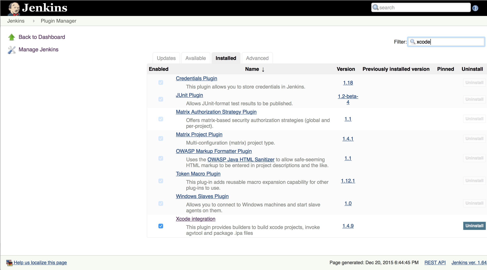

# Jenkins

    iOS jenkins CI Code Sign error: No matching provisioning profile found

    1.Ensure the project is building successfully from Xcode to real target.

    -In KeyChain
    2. Copy all the development cretificates & credentials form your user folder to the system folder

    3.Copy all the Provisioning profiles existing in
    ~/Library/MobileDevice/Provisioning Profiles
    to
    Jenkins/Library/MobileDevice/Provisioning Profiles

    sudo chown -R admin:staff xxx
    
Step1. 

Xcode plugin

FTP plugin

Step2. 