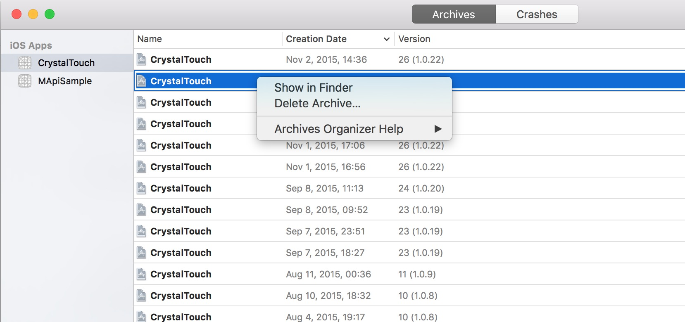
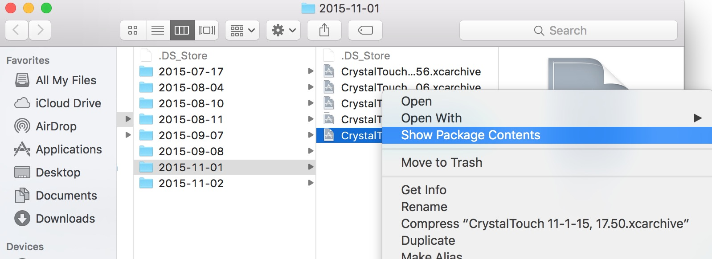
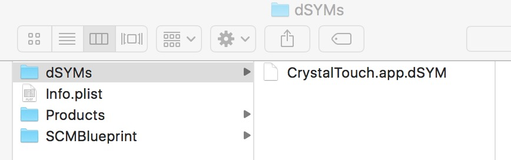
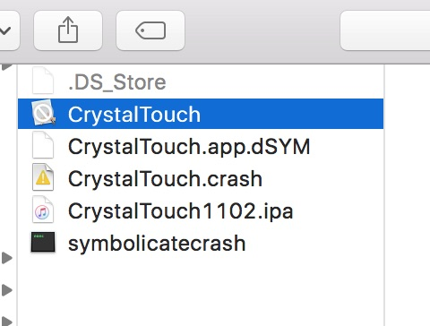
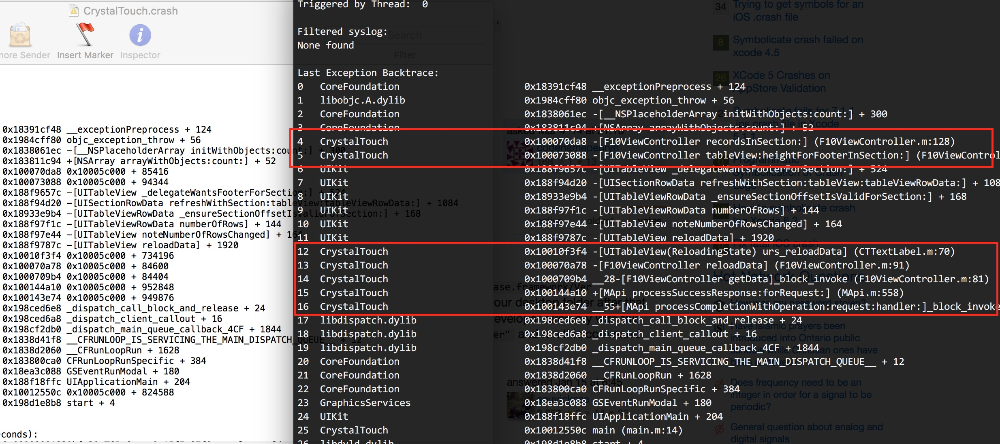

# Symbolicate

  
  
  
  


```
symbolicatecrash path
    Xcode6, Xcode7: /Applications/Xcode.app/Contents/Developer/Platforms/iPhoneOS.platform/Developer/Library/PrivateFrameworks/DTDeviceKit.framework/Versions/A/Resources/symbolicatecrash
    Xcode8: /Applications/Xcode.app/Contents/SharedFrameworks/DVTFoundation.framework/Versions/A/Resources/symbolicatecrash
copy symbolicatecrash, dSYM, crash to same directory
$ export DEVELOPER_DIR="/Applications/XCode.app/Contents/Developer" 
$ ./symbolicatecrash -v CrystalTouch.crash  CrystalTouch.app.dSYM
```



