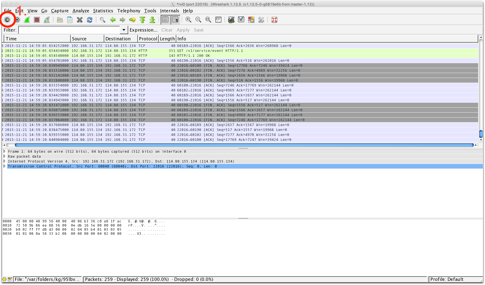
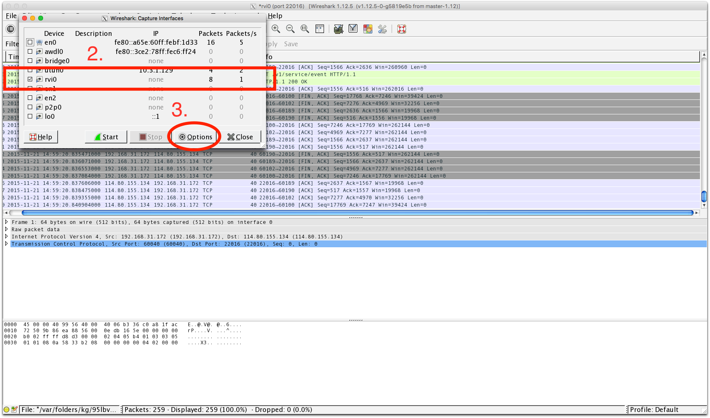
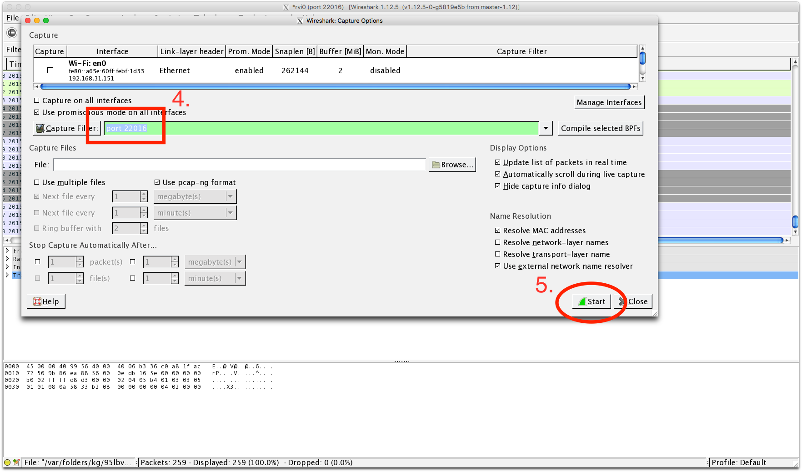
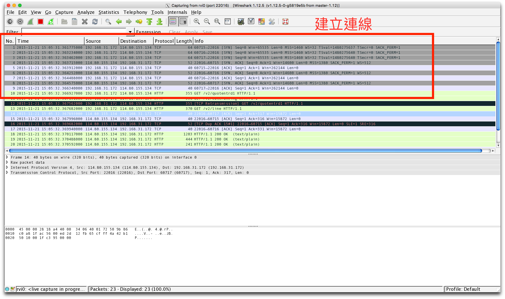
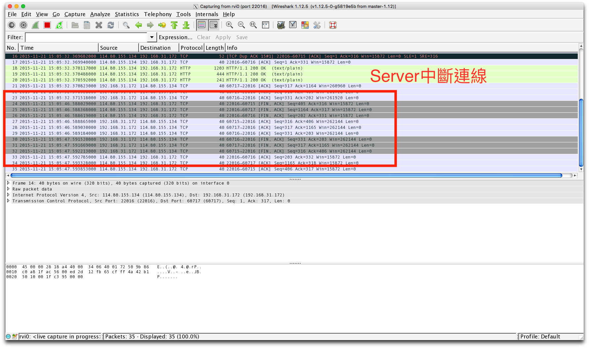

# Wireshark

[如何用wireshark看是否為keep alive](#KeepAlive)

    在Mac上抓取iPhone的封包：
    打入 rvictl -s <UDID> 指令，會出現類似
    Starting device UDID [SUCCEEDED] with interface riv0
    就可以在wireshark中選擇irv0抓取手機的封包
    
Step1

Step2

Step3

Step4

Step5
